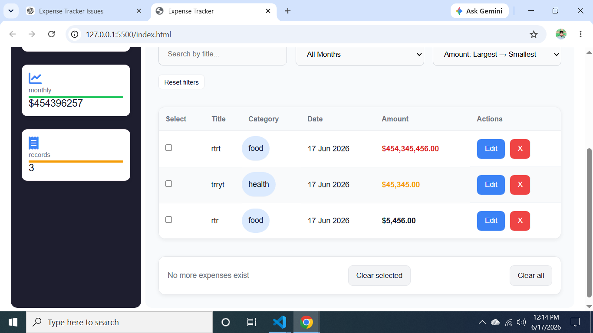
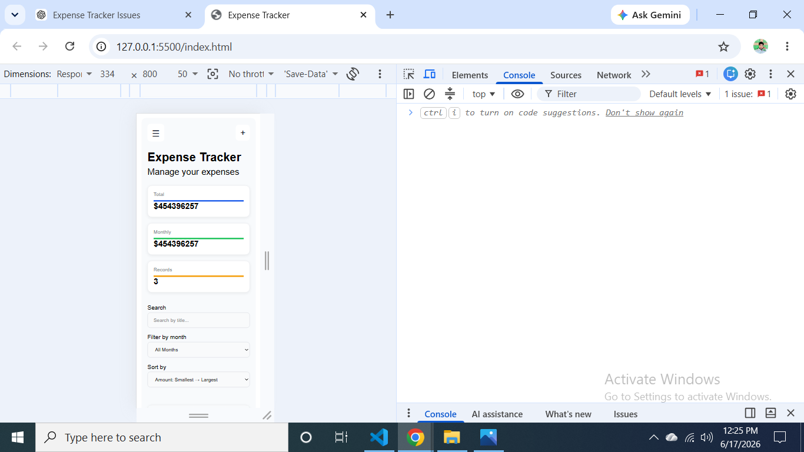

# Expense Tracker Project

## Live Demo

https://rafeeqhassani.github.io/expense-tracker-vanilla-js

## Source Code

https://github.com/rafeeqhassani/expense-tracker-vanilla-js

## Desktop View

## Mobile View

## About the Project

Expense Tracker is a Vanilla JavaScript application for managing daily and monthly expenses.

Users can add, edit, delete, search, sort, and filter expenses while tracking total spending in real time. All data is persisted using LocalStorage.

This project was built as part of my JavaScript learning journey. Initially, the application relied heavily on global variables and scattered state management. After learning React and understanding state-driven UI architecture, I refactored the entire Vanilla JavaScript version to follow a more structured state-based approach.

The goal of the refactor was to make the code easier to understand, maintain, debug, and extend while keeping the project framework-free.

## Features

- Add, edit, and delete expenses
- Keeps only the latest 500 expenses
- Load More pagination (40 initial items, +20 per click)
- Search expenses by title
- Sort expenses by date, amount, and title
- Filter expenses by month
- Select existing categories or create custom categories
- Real-time total and filtered total calculations
- Form validation
- LocalStorage persistence
- Dynamic UI rendering
- Bulk selection and removal of expenses

## Architecture

The application is organized into separate modules:

### app.js

Handles application state, event listeners, user interactions, and rendering flow.

### expense.js

Contains pure business logic functions such as:

- Add expense
- Update expense
- Delete expense
- Validation
- Search
- Sort
- Filter
- Data normalization

### storage.js

Handles LocalStorage persistence.

### ui.js

Contains DOM rendering utilities and reusable UI helpers.

## Technologies Used

- HTML5
- CSS3
- JavaScript (ES Modules)
- LocalStorage

## What I Learned

- DOM manipulation and event handling
- State-driven UI architecture without frameworks
- Separating business logic from UI logic
- Data normalization and validation
- CRUD application design
- LocalStorage persistence
- Debugging with DevTools, breakpoints, and console tracing
- Refactoring existing code for better maintainability
- Applying React-inspired state management concepts in Vanilla JavaScript

## Project Status

Current version is fully functional and actively maintained.

Recent refactors focused on:

- State-driven architecture
- Improved form handling
- Better code organization
- Separation of concerns

## Future Improvements

- Improved UI/UX design
- Expense analytics and charts
- Category-wise spending reports
- CSV/PDF export
- Dark mode
- Responsive mobile improvements
- Automated testing

## Note

This project was built through consistent self-learning and hands-on practice. The focus was not only on implementing features but also on understanding the reasoning behind the code, debugging real problems, and continuously refactoring the architecture as my JavaScript knowledge improved.
